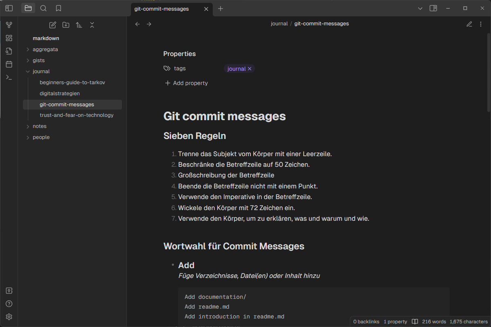
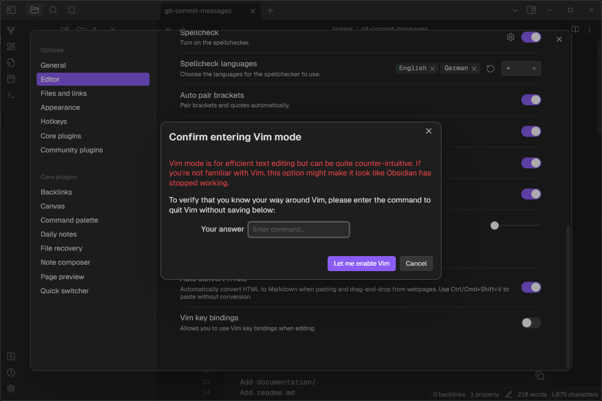
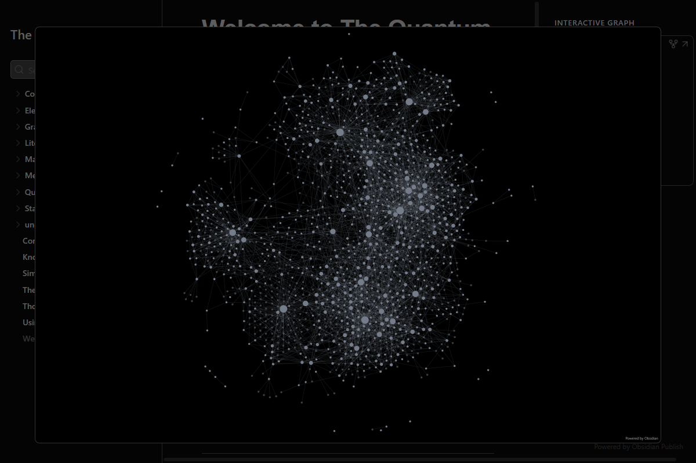
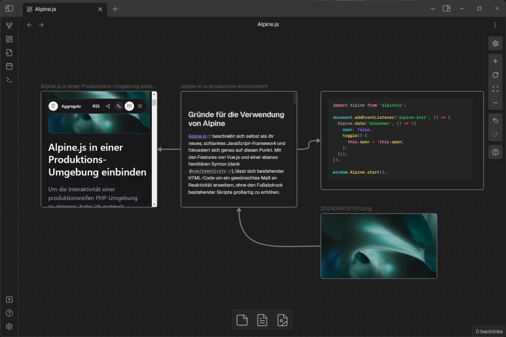
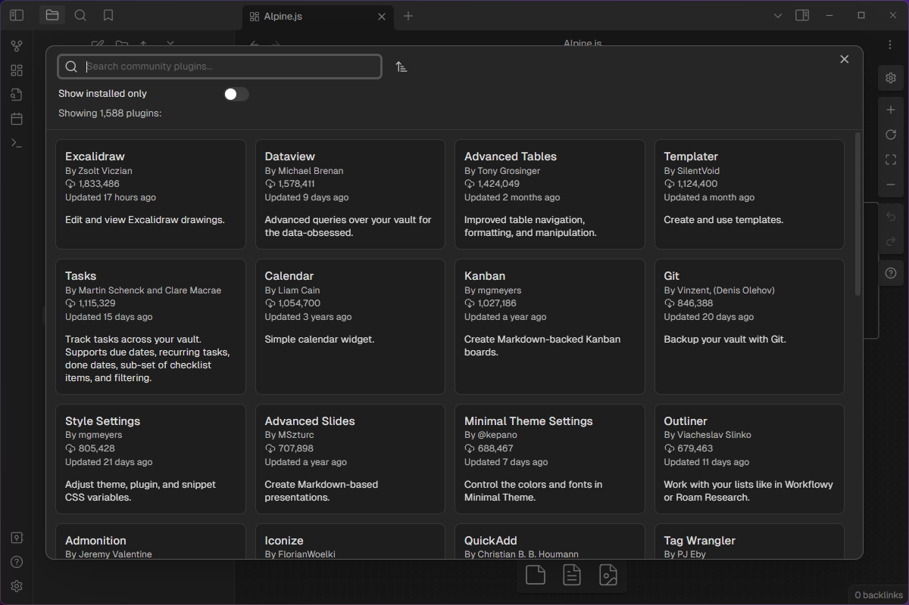

[Obsidian](https://obsidian.md/) describes itself as ***”… the private and flexible writing app that adapts to the way you think”*** and offers besides a Markdown text editor the capability to build your own knowledge base.

I’ve been using Obsidian personally for a year now, and I’ve grown quite fond of its focused approach to writing and organization. So I thought a dip into Obsidian’s feature pool might be in order.

_A shot of the Obsidan editor in reader view_

## Appearance

Obsidian’s minimalist approach to editing and organization sets it apart from other note-taking tools. Despite its minimalist appearance, the app offers a host of personalization options and even a Vim key bind mode for its more advanced users.

The look and feel of the interface and editor can be customized using custom fonts for the interface, text and monospace, and themes. Themes are provided by the community and can be extended or completely handcrafted using CSS.

*If the base application does not have a feature you may need, have a look at the available* [_plugins_](#plugins)_._

## Vaults

Your written pieces are stored in vaults. Vaults are nothing more than directories that use a hidden `.obsidian` directory to store your preferences. This makes the vaults themselves and their contents extremely portable across devices and other note-taking tools.

You can use multiple vaults to separate concerns, as a single vault can contain multiple directories. In this case, you can use one vault for personal matters and another for work-related files if you wish, or you can rely on the directory structure within a vault.

> Using Obsidian in a commercial context requires you to [obtain a license](https://obsidian.md/pricing).

*We’ll dive deeper into storing your vaults to access them across devices in* [_Storage, Sync & Publish_](#storage-sync--publish)_._

## Links

Links allow you to reference other files in your Vault from within your notes. This feature provides a navigable experience similar to platforms such as Wikipedia, where knowledge is linked to relevant pages.

Obsidian offers two methods for linking files and attachments together:

- **Wikilink**: `[[Three laws of motion]]`
- **Markdown**: `[Three laws of motion](Three%20laws%20of%20motion.md)`

## Graph

Linked or tagged files can be visualized in a graph that can be customised to display your linked files in a way that suits your needs. The floral nature of the patterns that appear has led the community to refer to some of their vaults as *digital gardens*.

Your garden grows with your vault and the knowledge it contains. In extreme cases, this can lead to huge interconnected documents on entire research topics, as is the case with [The Quantum Well](https://publish.obsidian.md/myquantumwell):

_Each node you see in this graph represents either a file, a tag or a linked reference._

## Canvas

The canvas is Obsidian’s powerful whiteboarding utility that works with files, attachments such as images and websites to give you spaces to visually structure your thoughts.

You can loosely group cards and attachments to iterate on something like a mood board, or use the ability to connect items with arrows to represent a flow.

## Plugins

Obsidian offers core plugins that are pre-installed and ready to use with the base application, as well as community plugins. Neat features like the command palette, canvas and file recovery are enabled by default.

In addition to the core plugins, there are community plugins that give you a huge list of advanced features and completely new feature implementations to choose from. You can choose to use [Excalidraw](https://excalidraw.com/) instead of the built-in canvas, or use Git within Obsidian to version your files.

## Storage, Sync & Publish

By default, Obsidian stores your [vault](#vaults) as a directory on your hard drive. From here, there are two preferred methods for sharing and synchronizing your files - one independent of Obsidian and one built into the application.

**Git** and services like [GitHub](https://github.com/) are ideal for storing your markdown files and synchronizing versions across devices. They may require you to take care of versioning your files, but they are somewhat independent of proprietary software.

[Sync](https://obsidian.md/sync) & [Publish](https://obsidian.md/publish) are two services offered by Obsidian to automate the synchronization and publishing of your files. Sync automates synchronization across devices, while Publish allows you to publish your vault as a website.

---

## TL;DR

Organizing your knowledge is satisfying. Obsidian’s minimalist approach includes a powerful set of features and plugins to aid the exploration of knowledge.
