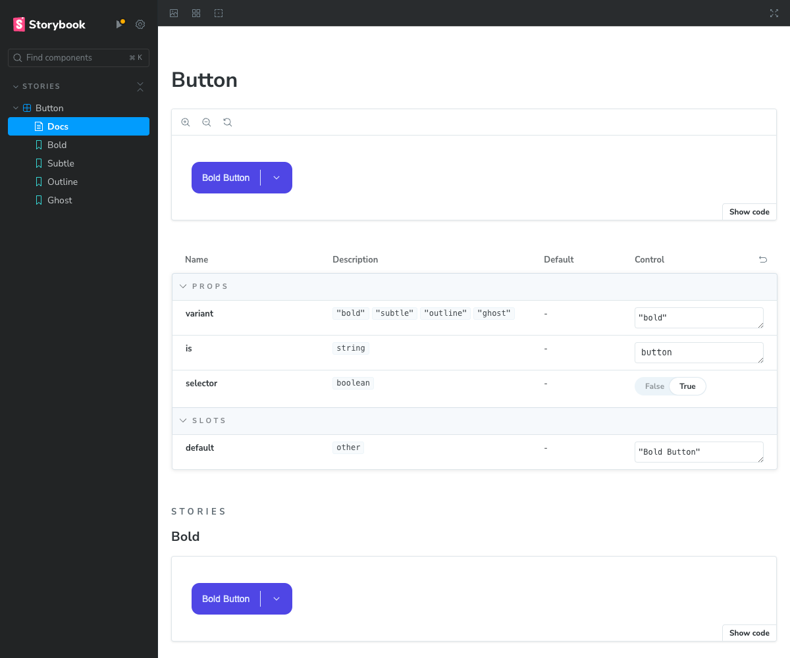

## Where we left off

In the [previous article](/archive/aggregata/define-a-component-library-for-designers-and-developers/), we explored how to define a component library based on the premise of communication. In this article, we will continue to explore the implementation of a component library for designers and developers alike, incorporating what we have learned so far.

## Requirements

The first step is for designers and developers to outline the requirements for the component in question. In our case, we will focus on a button component with an optional drop-down menu.

### Designers requirements

- Variants: Bold, Subtle, Outline, Ghost
- Label: Optional text to be displayed
- Icon: Optional icon besides label

### Developers requirements

- Agnostic: Supports HTML elements such as `<a>` or `<button>`
- Options: Reusable as a selector interface for options
- Accessible: Provides a title and is visibly focusable

At this stage, we can already identify future pain points: Variants and extensibility. Currently, designers request 4 variants for a color theme. In the future, however, we'll need to expand the number of themes to cover more options.

To put this into perspective, let's look into the future: Eventually we'll have 4 variants for 6 colors and 4 states per variant. This would result in 96 possible combinations. That is a lot of work for designers and developers to provide access to and maintain properly.

> How to overcome the creeping complexity of components is a topic we'll explore later in the series on component libraries. For now, let's focus on the initial requirements and stick to one color and 4 variants.

## Design

In Figma, the first draft of the new component is quickly created. It already contains the necessary elements, but lacks the variants. Before we get to that, let's take a look at the initial component as a starting point.


From here on, we [set up the component properties](https://help.figma.com/hc/en-us/articles/5579474826519-Explore-component-properties) to allow for easy combinations of label, icon, and selector elements within a variant. We now have 6 possible combinations of elements to choose from within one variant.


Once our initial component is properly set up, we can [create and use variants](https://help.figma.com/hc/en-us/articles/360056440594-Create-and-use-variants) to compose the desired variants of our button component. The previously set properties are automatically reapplied where applicable.


## Hand-Off

One way to share the component with developers is to use Figma's built-in [Dev Mode](https://www.figma.com/dev-mode/). This feature automatically exposes detailed information about the component, such as its properties and variants, to developers.

The hand-off itself is a very individual process and can be done in a variety of ways. Some teams prefer to use tools like [Zeplin](https://zeplin.io/), while others prefer a more direct approach, such as sharing a link to the figma file or using a shared folder.

## Develop

Developing the actual component comes down to deciding on a concise approach. In this case, we'll use [Vue 3](https://vuejs.org/) with the Composition API. This allows us to define the component in a single file, making it easier to maintain and understand.

Note that this is not the only way to create components. A popular example would be [daisyUI](https://daisyui.com/), which uses [TailwindCSS](https://tailwindcss.com/) and custom classes to simplify the creation of components, relying only on basic HTML elements and CSS to structure them.

> Please be aware that the `<Icon />` component is not included in the code snippet.

```vue
<script setup lang="ts">
import Icon from './Icon.vue';

defineOptions({ inheritAttrs: false });

const {
  variant = 'bold',
  is = 'button',
  selector = false,
} = defineProps<{
  variant?: 'bold' | 'subtle' | 'outline' | 'ghost';
  is?: string;
  selector?: boolean;
}>();
</script>

<template>
  <div :class="`button-${variant}`">
    <component
      class="center"
      :is="is || 'button'"
      v-bind="$attrs"
    >
      <slot />
    </component>
    <span
      class="separator"
      v-if="selector"
    ></span>
    <button
      v-if="selector"
      class="selector"
    >
      <Suspense>
        <Icon variant="NavArrowDown" />
      </Suspense>
    </button>
  </div>
</template>

<style scoped>
button {
  background: unset;
  color: inherit;
  border: unset;
}

[class^='button-'] {
  display: inline-flex;
  gap: 0.25rem;
  line-height: 1rem;
  padding: 0.25rem;
  align-items: center;
  border-radius: 0.75rem;
}

.button-bold {
  background: #4f46e5;
  color: #e0e7ff;
}

.button-subtle {
  color: #4f46e5;
  background: #e0e7ff;
}

.button-outline {
  color: #4f46e5;
  border: 0.0625rem solid #e0e7ff;
}

.button-ghost {
  color: #4f46e5;
}

.center {
  border-radius: 0.5rem;
  font-weight: 500;
  font-size: 0.875rem;
  padding: 0.75rem;
}

.separator {
  background: currentColor;
  height: 1.5rem;
  width: 0.0625rem;
}

.selector {
  display: flex;
  border-radius: 0.5rem;
  padding: 0.75rem;
}
</style>
```

```vue
<template>
  <Button>
    <span>Hello World</span>
    <Icon variant="ArrowRight" />
  </Button>
</template>
```

## Document

For both designers and developers, documentation serves as a reference point for the component's properties and variants. This can be done in a variety of ways, from a simple documentation site like [Docusaurus](https://docusaurus.io/) to a more elaborate documentation tool like [Storybook](https://storybook.js.org/).

In our case, we'll use Storybook to document the component. This allows us to show the component in different states and variants, as well as provide detailed information about its properties when needed.

```ts
import type { Meta, StoryObj } from '@storybook/vue3';
import Button from '../components/Button.vue';

const meta: Meta<typeof Button> = {
  component: Button,
  parameters: {
    slots: {
      default: {
        template: `<span>{{ args.default }}</span>`,
      },
    },
  },
};

export default meta;

type Story = StoryObj<typeof Button>;

export const Bold: Story = {
  args: {
    variant: 'bold',
    is: 'button',
    selector: true,
    default: 'Bold Button',
  },
};

export const Subtle: Story = {
  args: {
    variant: 'subtle',
    is: 'button',
    selector: true,
    default: 'Subtle Button',
  },
};

export const Outline: Story = {
  args: {
    variant: 'outline',
    is: 'button',
    selector: true,
    default: 'Outline Button',
  },
};

export const Ghost: Story = {
  args: {
    variant: 'ghost',
    is: 'button',
    selector: true,
    default: 'Ghost Button',
  },
};
```

Using Storybook's [Autodocs](https://storybook.js.org/docs/writing-docs/autodocs) feature, we can automatically generate documentation for the component based on its exposed properties and variants in the `Button.stories.ts` file.



## Maintain

Now that we've conceptualized, designed, developed, and documented our `<Button>` component, we need to maintain it. This includes keeping the component up to date with the latest design changes, fixing bugs, and adding new features as needed.

The task of maintenance cuts across all of the previous steps, as it is a shared responsibility between teams to keep design, development, and documentation in sync. Once a proper process is established, maintaining the component becomes much easier.

## Next article

Congratulations. You've taken the first steps toward creating a component library for your project or organization. While this article only covers the general approach, the next article will delve into the specifics of how to manage component complexity and keep it maintainable.

To accomplish this, we'll also look back at previous articles such as [Develop design systems with accessibility in mind](/archive/aggregata/develop-design-systems-with-accessibility-in-mind/), and how the patterns presented there can be applied to facilitate component library development.

## TL;DR

We've explored how to create a basic component library using a single component as a starting point. The process includes defining requirements, designing the component, handing it off to developers, developing the component, documenting it, and maintaining it.
