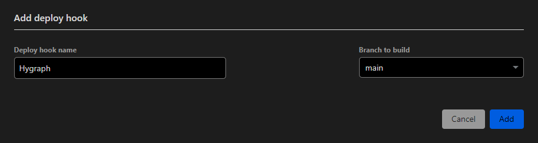
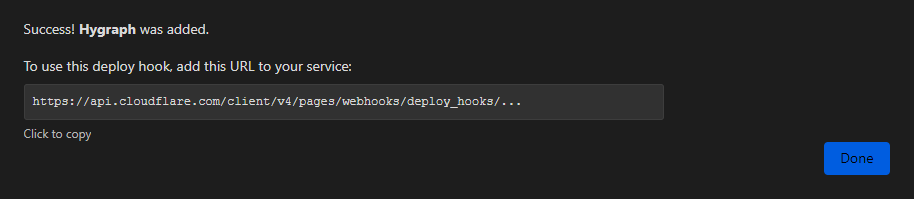

Content management systems (CMS) and frameworks (CMF) are widely used and highly regarded in the realisation of web projects. They are mainly used to communicate information and media.

You can use self-hosted or third-party applications to provide generic content. There are basically two preferred solutions for displaying content from a CMS or CMF on the web:

## Known strategies

### Server Side Rendering (SSR)

The traditional approach is for a CMS such as [Wordpress](https://wordpress.org/?ref=aggregata.de) or CMF such as [ProcessWire](https://processwire.com/?ref=aggregata.de) to manage the content of a page, provide an editorial system and, if necessary, display the content using templates.

Modern tech stacks use full-stack frameworks such as [Next.js](https://nextjs.org/?ref=aggregata.de), which take over the templating and retrieve content from the CMS via an interface, such as [Strapi](https://strapi.io/?ref=aggregata.de).

The server is responsible for preparing the content in the form of a page. Depending on the chosen approach, it also provides the content management system.

### Client Side Rendering (CSR)

In contrast to the traditional approach, client-side rendering makes the user’s browser responsible for preparing the content. The content is only obtained statically or via interfaces from the CMS.

## Static Site Generation (SSG)

The content is prepared when the static files are generated. An interface is required for this, either from the file system or from a CMS.

In smaller projects, it can make sense to manage the content via the file system. [Astro](https://astro.build/?ref=aggregata.de) is a tool that uses this approach to manage content in formats such as Markdown and prepare it using templates. Markdown is a format that remains readable in a text editor.

> We use the same approach to provide the content of Aggregata.

For larger projects, it is advisable to use CMS with interfaces. The content is obtained via the interface during generation and prepared accordingly.

In contrast to client-side and server-side presentation, static page generation has the disadvantage that the content is only updated when the static pages are generated again.

## Avoiding limitations

As static pages can only contain the content available at the time of generation, a solution must be developed that triggers a new generation when the content in the CMS is updated.

Webhooks are a solution to this limitation. They make it possible to transfer events from one platform to another. A change to the content in the CMS can thus trigger a new deployment of the project at the provider.

## Use case with Hypgraph and Cloudflare

In the next sections, I will present a specific scenario. This illustrates the approach described above with the providers Hypgraph as CMS and Cloudflare Pages for hosting.

To create a webhook as a deploy hook, we first navigate to the settings of our project on Cloudflare Pages. There we add a deploy hook under the **Builds & deployments** menu item.

We simply enter a name for the deploy hook and select the branch of our project that is to be used for deployment from an SCM such as [GitHub](https://github.com/?ref=aggregata.de).

Cloudflare then provides a URL to trigger the deployment. This URL can now be transferred to Hygraph.

We navigate to the **Webhooks** menu item in the Hygraph interface and create a new webhook. This accesses the URL of the Cloudflare Pages deploy hook. If necessary, various triggers from the CMS can also be configured.

> If the use of Hygraph is restricted to published content, the Stage option should be set to Published. This avoids adjustments to unpublished drafts that could trigger further deployments.

Once the webhook has been successfully configured in Hygraph, a new entry is added to the page. This contains the corresponding URL of the deploy hook and the status **Active**.

When we make changes to the published content, Hypgraph transfers this information to Cloudflare Pages. This redeploys the project to ensure that the content of the website matches that of the CMS.

## Advantages & disadvantages of this use case

In this use case, the performance of the website is favourable. It is delivered with static HTML and does not require server-side pre-processing. This can drastically reduce the response time of a single page.

However, a large number of content changes can lead to a delay before they become visible on the website. Deployments can be grouped to reduce the number of deployments required.

> Restrictions may apply depending on the provider and plan selected. For example, [Vercel](https://vercel.com/?ref=aggregata.de) limits deployments in the Hobby plan to 100 and in the Pro plan to 600 per day.

This use case is generally recommended for sites with a low frequency of content changes that do not necessarily rely entirely on real-time data for their content.

Examples of this use case are personal websites such as blogs and portfolios as well as smaller information and company websites.

This allows us to deliver websites with dynamic content at the speed of static without having to forego the modern functions of an editorial system.

## TL;DR

With static page generation, you can deliver websites with optimized performance. Combine this with webhooks and automated deployments to deliver dynamic content at the speed of static.
