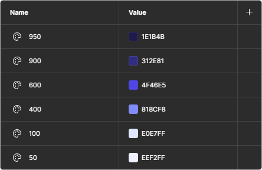
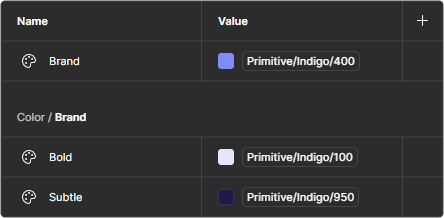

## Where we Left Off

Previous, we learned how to [Create a Component Library for Designers and Developers](/archive/aggregata/create-a-component-library-for-designers-and-developers/) by implementing a fairly simple button component. In this article we'll expand on the previously established foundation and display how to handle more extensive components.

To facilitate our desired outcome, we'll build on some of the ideas presented in [Develop design systems with accessibility in mind](/archive/aggregata/develop-design-systems-with-accessibility-in-mind/) and implement design tokens to manage the colors and appearance of our components during design and development.

## New Requirements

Before we get into the specifics of the design tokens, let's add to the previous requirements of our button component. In this particular case, the button component should now cover several color variants to convey its possible actions.

### Designers Requirements

- Colors
  - Brand
  - Neutral
  - Informative
  - Successful
  - Cautionary
  - Destructive

This additional requirement increases the number of variants of the component to 24. While this is still manageable within Figma using [Multi Edit](https://help.figma.com/hc/en-us/articles/21635177948567-Edit-objects-on-the-canvas-in-bulk), the creeping complexity necessitates a more structured approach to handling variants and their appearance.

## Design Tokens in Figma

Design tokens, or [Variables](https://help.figma.com/hc/en-us/articles/15339657135383-Guide-to-variables-in-Figma) as they're called in Figma, help us define a consistent design language for our components. To be more precise and flexible in the future, we'll divide the tokens into two groups: Primitives and Semantics.

### Primitives

Primitives serve as the foundation of our design language. They define base colors and other units to built upon. To start, add the desired colors to the [Local Variables](https://help.figma.com/hc/en-us/articles/15145852043927-Create-and-manage-variables) table. In this example, we'll use the [Tailwind CSS color palette](https://tailwindcss.com/docs/customizing-colors) to define the colors.



### Semantics

Semantics built on primitives to expose verbose tokens for our layouts, pages, and components. They reference the primitive tokens and act as an interface to populate the components with the colors defined in the design language.



To recap, raw values like #e4e4e7 can be defined as a primitive token like Indigo 600. This primitive token in turn is referenced by one or more semantic tokens such as Brand. In it's fullest, this could take the following form:

| Token                    | Reference               | Value     |
| ------------------------ | ----------------------- | --------- |
| Border/Width             | ←                       | 1         |
| Color/Neutral/Subtle     | ← Primitive/Zinc/200    | ← #e4e4e7 |
| Color/Neutral            | ← Primitive/Zinc/950    | ← #09090b |
| Color/Brand/Subtle       | ← Primitive/Indigo/100  | ← #e0e7ff |
| Color/Brand              | ← Primitive/Indigo/600  | ← #4f46e5 |
| Color/Informative/Subtle | ← Primitive/Sky/100     | ← #e0f2fe |
| Color/Informative        | ← Primitive/Sky/600     | ← #0284c7 |
| Color/Successful/Subtle  | ← Primitive/Emerald/100 | ← #d1fae5 |
| Color/Successful         | ← Primitive/Emerald/600 | ← #059669 |
| Color/Cautionary/Subtle  | ← Primitive/Amber/100   | ← #fef3c7 |
| Color/Cautionary         | ← Primitive/Amber/600   | ← #d97706 |
| Color/Destructive/Subtle | ← Primitive/Rose/100    | ← #ffe4e6 |
| Color/Destructive        | ← Primitive/Rose/600    | ← #e11d48 |

Plugins like [variables2css](https://www.figma.com/community/plugin/1261234393153346915/variables2css) export the defined design tokens in various formats for use in our project. From here on out, we head into the development phase and start by defining the primitives and semantics in CSS.

## Design Tokens in Development

Once the design tokens are exported in their respective formats and implemented in the project, we can start using them in our button component to define the colors and their variants. One way to do this is to define the tokens as CSS variables.

```css
:root {
  --primitive-amber-100: #fef3c7;
  --primitive-amber-400: #fbbf24;
  --primitive-amber-600: #d97706;
  --primitive-amber-950: #451a03;
  --primitive-emerald-100: #d1fae5;
  --primitive-emerald-400: #34d399;
  --primitive-emerald-600: #059669;
  --primitive-emerald-950: #022c22;
  --primitive-indigo-100: #e0e7ff;
  --primitive-indigo-400: #818cf8;
  --primitive-indigo-600: #4f46e5;
  --primitive-indigo-950: #1e1b4b;
  --primitive-rose-100: #ffe4e6;
  --primitive-rose-400: #fb7185;
  --primitive-rose-600: #e11d48;
  --primitive-rose-950: #4c0519;
  --primitive-sky-100: #e0f2fe;
  --primitive-sky-400: #38bdf8;
  --primitive-sky-600: #0284c7;
  --primitive-sky-950: #082f49;
  --primitive-zinc-50: #fafafa;
  --primitive-zinc-100: #f4f4f5;
  --primitive-zinc-200: #e4e4e7;
  --primitive-zinc-300: #d4d4d8;
  --primitive-zinc-400: #a1a1aa;
  --primitive-zinc-500: #71717a;
  --primitive-zinc-600: #52525b;
  --primitive-zinc-700: #3f3f46;
  --primitive-zinc-800: #27272a;
  --primitive-zinc-900: #18181b;
  --primitive-zinc-950: #09090b;
}
```

To maintain compatibility between design and development, we implement the same separation of tokens and naming conventions. This way, design tokens can be used and kept in sync in both Figma and the project.

```css
:root {
  --border-width: 0.0625rem;
  --color-neutral-subtle: var(--primitive-zinc-200);
  --color-neutral: var(--primitive-zinc-950);
  --color-brand-subtle: var(--primitive-indigo-100);
  --color-brand: var(--primitive-indigo-600);
  --color-informative-subtle: var(--primitive-sky-100);
  --color-informative: var(--primitive-sky-600);
  --color-successful-subtle: var(--primitive-emerald-100);
  --color-successful: var(--primitive-emerald-600);
  --color-cautionary-subtle: var(--primitive-amber-100);
  --color-cautionary: var(--primitive-amber-600);
  --color-destructive-subtle: var(--primitive-rose-100);
  --color-destructive: var(--primitive-rose-600);
}
```

## Programmatic Components

The rigidity of our design tokens allows us to programmatically generate CSS classes for all colors. Rather than defining classes manually, we rely on [SCSS](https://sass-lang.com/) to generate the classes for us and map their values using scoped CSS variables.

Further optimization of style generation and CSS bundle size can be achieved using tools such as [PurgeCSS](https://purgecss.com/) or [Tailwind CSS Layers](https://tailwindcss.com/docs/adding-custom-styles#using-css-and-layer), which automatically remove unused classes and styles and reduce the overhead of programmatically generated classes.

To update the component in question, we define the color property and add SCSS to generate the necessary classes. Then we update the component to use the updated classes and properties, and then its off to update the documentation to match our changes.

```vue
<script setup lang="ts">
import Icon from './Icon.vue';

defineOptions({ inheritAttrs: false });

const {
  variant = 'bold',
  color = 'brand',
  is = 'button',
  selector = false,
} = defineProps<{
  variant?: 'bold' | 'subtle' | 'outline' | 'ghost';
  color?: 'brand' | 'neutral' | 'informative' | 'successful' | 'cautionary' | 'destructive';
  is?: string;
  selector?: boolean;
}>();
</script>

<template>
  <div :class="['button', variant, color]">
    <component
      class="center"
      :is
      v-bind="$attrs"
    >
      <slot />
    </component>
    <span
      class="separator"
      v-if="selector"
    ></span>
    <button
      v-if="selector"
      class="selector"
    >
      <Suspense>
        <Icon variant="NavArrowDown" />
      </Suspense>
    </button>
  </div>
</template>

<style scoped lang="scss">
.button {
  display: inline-flex;
  gap: 0.25rem;
  line-height: 1rem;
  padding: 0.25rem;
  align-items: center;
  border-radius: 0.75rem;
}

.bold {
  background: var(--button-color);
  color: var(--button-color-subtle);
}

.subtle {
  background: var(--button-color-subtle);
  color: var(--button-color);
}

.outline {
  box-shadow: inset 0 0 0 var(--border-width) var(--button-color-subtle);
  color: var(--button-color);
}

.ghost {
  color: var(--button-color);
}

$colors: 'brand', 'neutral', 'informative', 'successful', 'cautionary', 'destructive';

@each $color in $colors {
  .#{$color} {
    --button-color: var(--color-#{$color});
    --button-color-subtle: var(--color-#{$color}-subtle);
  }
}

.center {
  border-radius: 0.5rem;
  font-weight: 500;
  font-size: 0.875rem;
  padding: 0.75rem;
  white-space: nowrap;
  text-decoration: unset;
}

.separator {
  background: currentColor;
  height: 1.5rem;
  width: 0.0625rem;
}

.selector {
  display: flex;
  border-radius: 0.5rem;
  padding: 0.75rem;
}
</style>
```

## Update the Documentation

Properties and their values are automatically added and updated by Storybook's [Autodocs](https://storybook.js.org/docs/writing-docs/autodocs) feature. We can also improve the usability of components in Storybook by setting argument types for our component to enhance interactions.

These argument types are part of the `meta` object in the story definition and are used to generate the controls for the component in Storybook. This way, we can easily switch between the different color variants of the button component.

```ts
const meta: Meta<typeof Button> = {
  // ...
  argTypes: {
    variant: {
      control: 'select',
      options: ['bold', 'subtle', 'outline', 'ghost'],
    },
    color: {
      control: 'select',
      options: ['brand', 'neutral', 'informative', 'successful', 'cautionary', 'destructive'],
    },
  },
};
```

## Next Article

In the follow up article, we'll extend the button component by adding states. In particular, we'll cover interaction states such as `:hover`, `:focus`, `:active` and `:disabled`, and how to implement them in combination with our existing colors and variants.

## TL;DR

Expand a component library using design tokens for consistent color variants. Implement primitive and semantic tokens in Figma and update Storybook documentation for improved developer and designer collaboration.
