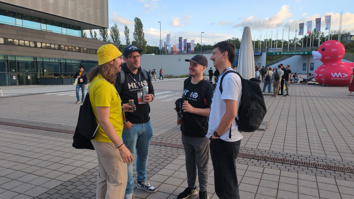

## Wednesday

As I did last year, I arrived on Wednesday to take part in the pre-check-in event. Shortly before the event itself, we visited a local Latin American restaurant in preparation for the evening ahead, which featured events organised by CARIAD and other hosts.

| Time          | Session                                                            |
| ------------- | ------------------------------------------------------------------ |
| 17:00 – 19:30 | Visit to the Latin American restaurant Paracas II                  |
| 19:30 – 21:30 | Check-in & Badge Pickup powered by CARIAD @Volkswagen DRIVE.studio |

## Thursday

As usual, Thursday marked the opening day of the congress, featuring a keynote by GitHub's CEO, Thomas Dohmke, who attempted to demonstrate the improved capabilities of GitHub Copilot. Rather amusingly, this demonstration did not go as smoothly as expected, however.

This year, I am focusing on a mix of holistic and in-depth topics in order to strike a balance between leadership and developer experience, and to develop my capabilities further in line with my promotion to a senior engineering position.

| ★   | Time          | Session                                                                                        |
| --- | ------------- | ---------------------------------------------------------------------------------------------- |
|     | 09:15 – 09:30 | Official Opening of WeAreDevelopers World Congress 2025                                        |
|     | 09:30 – 10:00 | Agents for the Sake of Happiness                                                               |
|     | 10:10 – 10:40 | Optimistic UI Updates: Enhancing User Experience and Improving Interaction to Next Paint (INP) |
|     | 10:50 – 11:20 | How Visionary Leaders Drive Transformation                                                     |
| ★   | 11:30 – 12:00 | Web-Fragments: incremental micro-frontends migration approach for enterprise                   |
| ★   | 13:15 – 13:20 | ShapeShift: Reinventing Agile for a B2B SaaS Scale-Up                                          |
|     | 15:30 – 16:00 | The future of Stack Overflow as the most vital source for technologists                        |
| ★   | 16:10 – 16:40 | Possibilities with Web Capabilities                                                            |
|     | 16:50 – 17:20 | Videogames: The Medium of the 21st Century                                                     |
|     | 17:30 – 18:00 | From Vision To Victory - What It Takes to Succeed in Tech Today                                |
|     | 20:00 – 22:00 | Official Congress Party powered by WeAreDevelopers                                             |

Unlike last year, this time I will summarise my favourite sessions from each day and share what I learnt from each one. As my last article was rather superficial, I expect this one to be more valuable.

### [Web-Fragments: incremental micro-frontends migration approach for enterprise](https://www.youtube.com/watch?v=WD-KkXAJY_U)

This session helped me to bridge the gaps that I have been exploring in recent weeks regarding monoliths for my article series, '[_Migrating the Monolith_](/archive/aggregata/migrating-the-monolith-i-conceptualization/)', as well as helping me to develop a concept for decoupling frontends and easing migration into new stacks for existing applications.

### [Possibilities with Web Capabilities](https://www.youtube.com/watch?v=MlNccgqSzbQ)

As an [advocate of native web capabilities](/archive/aggregata/the-future-of-the-web-might-be-native/), I found this session particularly enlightening. It broadened my understanding of the offerings available and reaffirmed my belief that it provides a practical and future-proof foundation for developing capable web applications.

### [ShapeShift: Reinventing Agile for a B2B SaaS Scale-Up](https://www.youtube.com/watch?v=_AI56iglIks)

Although I am biased towards this session, I would still like to point out that this session successfully condenses our current in-house approach to cycles into a brief 5-minute overview, offering a concise yet accessible insight into our processes.

[Milton Leon](https://www.linkedin.com/in/miltonleon86/) presenting [**Reinventing Agile for a B2B SaaS Scale-Up**](https://www.youtube.com/watch?v=_AI56iglIks)

## Friday

| ★   | Time          | Session                                                                      |
| --- | ------------- | ---------------------------------------------------------------------------- |
|     | 09:40 – 10:10 | Outsmarting the System: What Game Cheaters Can Teach Us About Cyber Security |
| ★   | 10:20 – 10:50 | End-to-End TypeScript: Completing the Modern Development Stack               |
| ★   | 11:00 – 11:30 | Oh S\*\*\*! There's a New Accessibility Law and I'm Not Ready!               |
|     | 11:40 – 12:10 | Client-Side State Management Reimagined – Think Outside the Box              |
| ★   | 13:00 – 13:30 | Building Developer Experience - Brick by Brick                               |
|     | 14:20 – 14:50 | Building a framework-independent component library                           |

### [End-to-End TypeScript: Completing the Modern Development Stack](https://www.youtube.com/watch?v=G82IIetQ808)

Recently, I explored various TypeScript-based stack combinations and found some solutions to outstanding problems in this session, such as unified type definitions and validation with [Zod](https://zod.dev/), and how to integrate them in an agnostic backend environment like [Hono](https://hono.dev/).

### [Oh S\*\*\*! There's a New Accessibility Law and I'm Not Ready!](https://www.youtube.com/watch?v=h03tv2oTqG4&embeds_referring_origin=https%3A%2F%2Fapp.wearedevelopers.com)

[Accessibility is not an afterthought](/archive/aggregata/accessibility-a-necessity-not-an-afterthought/). That has been my credo for some time now, and this talk has expanded my existing knowledge of testing approaches and tools, providing a more refined and robust foundation for future implementations internally as well as externally.

### [Building Developer Experience - Brick by Brick](https://www.youtube.com/watch?v=QB1gyitYUbI&embeds_referring_origin=https%3A%2F%2Fapp.wearedevelopers.com)

The LEGO Group's shift into the digital realm began decades ago with Lego Island, a favourite of mine, and has continued with an astonishing number of developers whose knowledge must be managed and preserved. They presented this in a lovingly crafted presentation to follow.

## Reflection

This year was different. To be completely honest, some of the talks felt rather superficial and basic, which left me feeling rather unsatisfied. Nevertheless, I managed to gain valuable insights from the sessions I marked as favourites, and I wholeheartedly recommend them.

Another difference was our presence at the congress. Our group doubled in size, we had our own booth and held a session, and we were frequently recognised by other attendees and exhibitors, most likely due to our eye-catching display of group size and colour.

Overall, I would rate this year's congress as a success, and I hope to have the privilege of attending again next year. Special thanks to my colleagues, and in particular to Lennart, for accompanying me to, from and around the congress.

Our beautiful group of 24+ people

## TL;DR

At WeAreDevelopers 2025, I enjoyed standout sessions on micro-frontends, additions to the modern tech stack, team development and developer experience. Despite some superficial sessions in-between, these provided meaningful takeaways.
