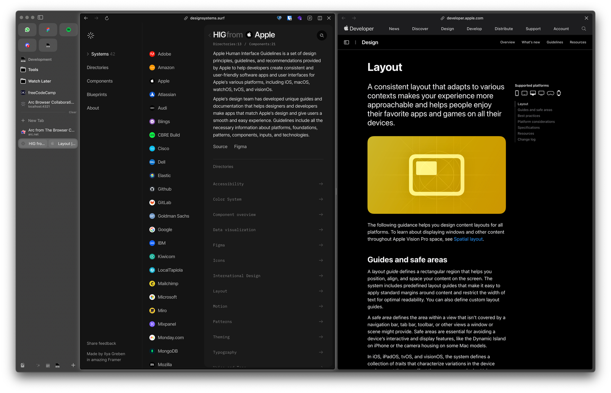
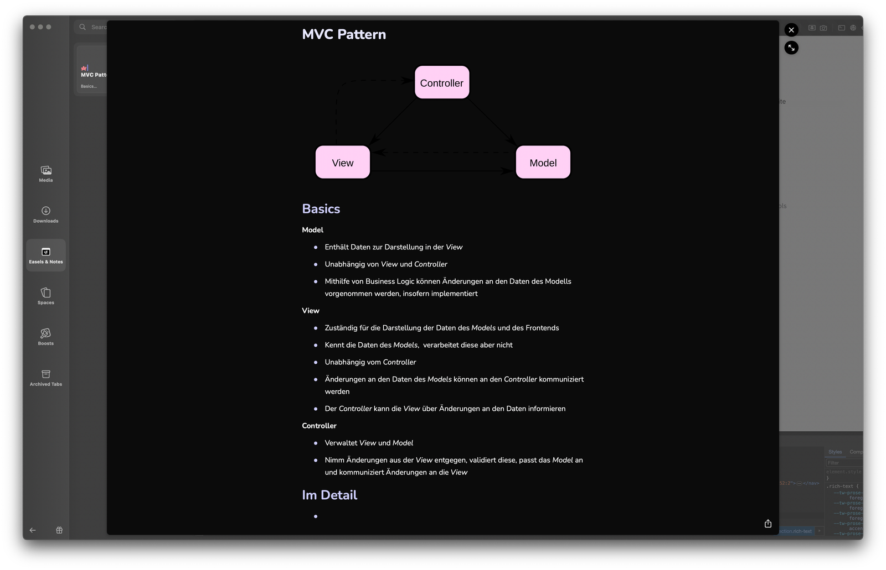
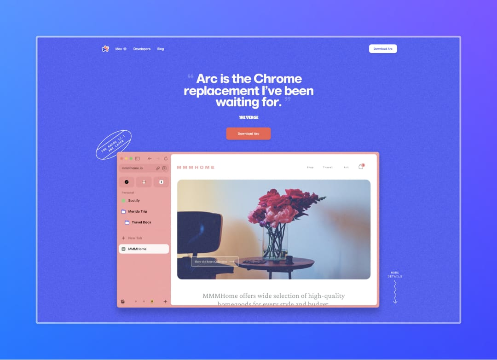

I’ve been using the [Arc Browser](https://arc.net/) from *The Browser Company* for a good six months now and have been pleasantly surprised by every major update so far. For this reason, I’d like to introduce you to the browser and its features in more detail today.

Like any other browser, the Arc Browser initially does exactly what it is supposed to do: browse. However, what makes it stand out from the crowd are the small, detailed interactions and features that expand or change a page in addition to the actual browsing.

_A shot of the Arc Browser start page with portrait mode_

## Onboarding

Onboarding is as personal as you would expect from a modern application. From importing your own data from another browser, pre-configuring bookmarks with known services, customizing your own color palette and browser look to choosing an ad blocker - the Arc Browser tries to offer its users a simple, personal and direct introduction to their own experience.

## Tabs & Views

Arc divides tabs into two groups: Temporary and permanent tabs. [Temporary tabs](#archive) close automatically after 24 hours, unless otherwise specified in the settings, while permanent tabs function like bookmarks and can be organized accordingly via folders.

Tabs can be arranged in views so that several tabs can be displayed as a group in one window. Common Window Manager views can be configured for a group, and this group can be saved as permanent tabs.

## Spaces

Spaces organize tabs in individual groups, which can be switched between with a swipe across the sidebar. With their own color palette, Spaces influence the appearance of the browser and visually support the communication of the working environment.

Spaces are configured in combination with profiles, e.g. to separate professional and private accounts or to manage multiple developer accesses to an application. If no further profiles are created, all Spaces share a profile and the associated sessions.

## Features

In addition to the options for personalizing and organizing the browser, Arc also offers features for managing pages and files within the application. Some important features should therefore not go unmentioned.

### Arc Max

Arc Max is Arc’s AI assistant, whose task is to make your own workflow easier by delegating repetitive tasks to it. Automatic renaming of tabs and downloads, summaries and answers in real time as well as an integrated chat function with ChatGPT make it easier to search for and collect information.

Although no details on the marketing of this feature are currently known, the CEO of Browser Compnay, Josh Miller, has opened a [survey on X](https://twitter.com/joshm/status/1711582180210594215) on possible pricing models for Arc Max.

### Library

The library organizes Spaces, downloads, the archive, but also Arc’s own features such as media, notes and boosts. The library can be accessed at any time via the sidebar and provides an overview of your own content.

#### Media & Downloads

Arc separates downloads into media and other files and documents. While both views share a MacOS-like preview, media is visualized as tiles, while downloads can be displayed and searched in a familiar list.

#### Easels & Notes

Easel is Arc’s integrated whiteboard tool that allows you to draw directly from the browser, which can be essential for research or designing a mood board.

Notes use a Markdown-based WYSIWYG editor that allows information to be captured quickly. Media and files can be quickly attached to a note by copying and pasting.

Easels & notes use the same logic as tabs and can be organized in the sidebar like a tab, i.e. also in different spaces and views.

#### Boosts

Boosts make it possible to profoundly influence the appearance of a page. Colors, fonts, custom code and the deletion of selected page elements make it possible to customize the browser experience.

#### Archive

The archive collects closed and temporary tabs so that they are never completely lost, and offers a practical filter to get an overview of closed tabs by Close and Space.

---

In addition, Arc offers many predefined [integrations](https://arc.net/integrations) for various websites such as Outlook or Google Calendar, which provide permanent tabs around intelligent features such as a calendar preview or a list of recently accessed documents in the application.

## Development tools

Beyond Chromium’s familiar development tools, Spaces can be used for sessions and testing. There is also a dedicated portrait mode for presenting a website and a sophisticated page content capture feature.

**Portrait Mode**

Portrait mode presents the page in front of a suitable background or optionally in front of a definable color gradient or your own screen background. Presentations of applications can thus be designed quickly and attractively.

**Capture**

Saving page content is also integrated in [Media](#media--downloads) and Easels, but also offers its own editing function. The recordings can otherwise be saved or sent via the dialog options.

---

## TL;DR

Everything is possible – nothing is mandatory. The Arc Browser offers many detailed features for personalizing your own browsing experience and complements this with a seamless organization of your own working environment.
