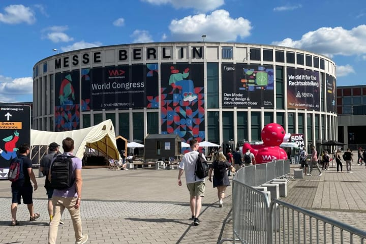
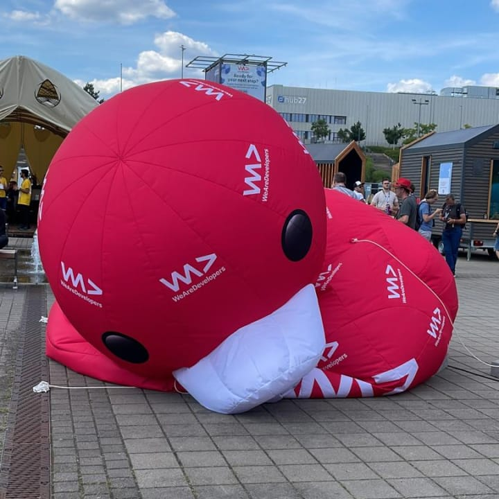

Last week I had the privliege to spend three days in Berlin with my employer [HERO Software](https://hero-software.de/) at the WeAreDevelopers World Congress 2024. It was a great opportunity to learn from and network with other developers.

I wanted to take some time to share some of the highlights of the congress and key insights from the various events I attended and developers I met. Consider this not an in-depth review, but rather a brief overview of my experience.

My schedule was packed with events, networking, and navigating the congress. Especially on thursday, I had to make some tough decisions about which events to attend. While I managed to strike a good balance between topics, I still missed some interesting events regardless.

## Wednesday

Wednesday marked the arrival of our group in Berlin and the pre-check-in event at the Motel One Upper West. The day ended with a visit to a local Cuban restaurant shortly after picking up our badges and getting to know some of the other attendees.

| Time          | Event                                      |
| ------------- | ------------------------------------------ |
| 18:00 — 21:00 | Pre-Check-In Event at Motel One Upper West |

_Our beautiful group of people at the south side entrance of the congress_

## Thursday

Thursday was the first day of the congress and the busiest day of the week. The congress opened with a rhetorically engaging keynote by David Simas, former White House Director of Political Affairs.

After the opening keynote, we had a packed schedule of events that not only filled the entire day, but extended into the night with the official congress party. All around I managed to spent around 16 hours at the congress on Thursday.

| Time          | Event                                                                     |
| ------------- | ------------------------------------------------------------------------- |
| 09:00 — 09:30 | Offical Opening of WeAreDevelopers World Congress                         |
| 09:30 — 10:00 | Opening Keynote: Civic Coding, A Framework for Democratic Tech            |
| 10:10 — 10:40 | What's New and What's Next in Web UI                                      |
| 10:50 — 11:20 | Using LLMs in your Product                                                |
| 11:30 — 12:00 | Fighting Digital Threats in the Age of AI                                 |
| 12:10 — 12:40 | Modulith Instead of Monolith - Pragmatically Towards Microservices        |
| 13:30 — 14:00 | Beyond Warp Speed: Crafting the Future of Web Development with Astro 4.10 |
| 16:10 — 16:40 | Common Mistakes in Vue.js and How to Avoid Them                           |
| 16:50 — 17:20 | Deep Fakes: The Lies We Can't See                                         |
| 18:00 — 20:00 | Hot beats and cold drinks at CARIAD                                       |
| 20:00 — 23:59 | Official Congress Party powered by WeAreDevelopers                        |

_The congress center as seen from the entrance on the south side_

## Friday

Friday was a bit more relaxed than Thursday and I was able to focus on some more specific topics and networking in particular. Of particular note was a fascinating chat with Daniel Kelly from Vue School about his talk the day before and some of the finer points of working with Vue.js.

| Time          | Event                                                  |
| ------------- | ------------------------------------------------------ |
| 12:20 — 12:50 | Beyond micro-services, embrace composable architecture |
| 13:40 — 14:10 | WebAssembly: The Next Frontier of Cloud Computing      |
| 15:00 — 15:30 | JSON and Beyond                                        |
| 16:20 — 16:50 | Bridging the gap between design and development        |

_Even the duck at the entrance was sad that the congress was coming to an end_

## Reflection

Summarizing every event and conversation would be quite cumbersome, but here are some of my personal key insights from this year's WeAreDevelopers World Congress:

1. **The integration of AI into products presents both opportunities and challenges**
   While AI capabilities enhance user experiences and product functionalities, they also introduce security risks. It is therefore essential that developers are aware of potential threats and adopt measures to protect against AI-driven attacks.

2. **The importance of embracing composable architecture**
   Beyond micro-services, composable architecture allows for greater flexibility and scalability in web development. By breaking down applications into smaller, reusable components, developers can create more efficient and maintainable systems.

3. **The evolving landscape of web development technologies**
   From the discussions on the future of Web UI, the use of LLMs in products, to the exploration of WebAssembly, it's clear that the field of web development is rapidly evolving. Staying informed and adaptable to these changes is crucial for developers to build cutting-edge applications.

## TL;DR

In conclusion, the WeAreDevelopers World Congress 2024 in Berlin proved to be a valuable experience. From thought-provoking keynotes to enlightening events on developing technologies and trends, the congress offered a wealth of insights and networking opportunities.
