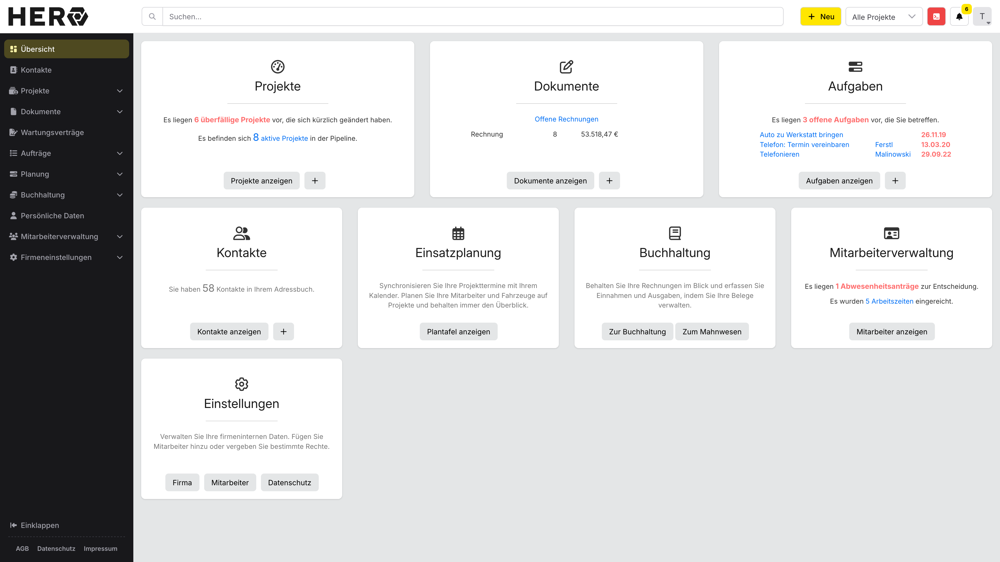
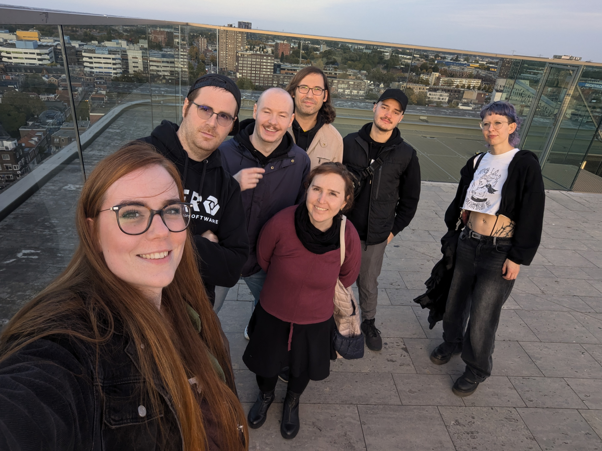
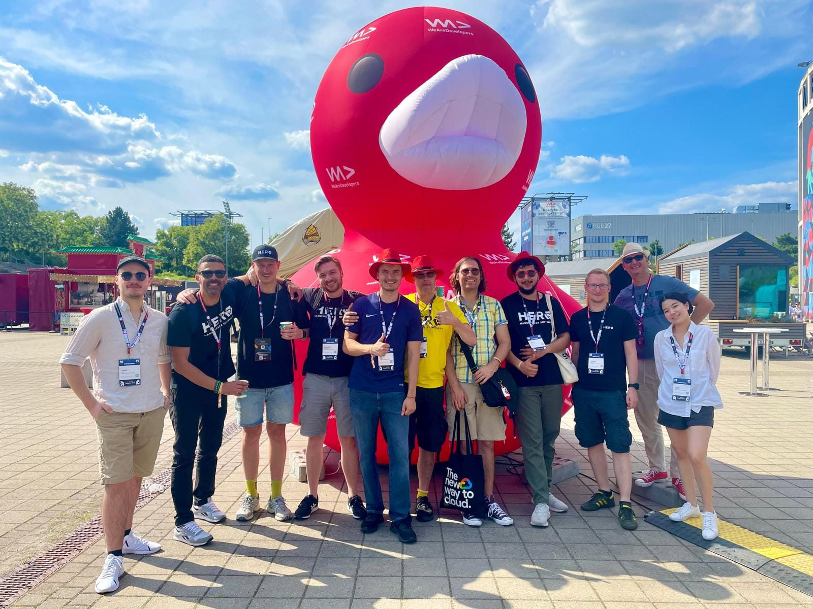
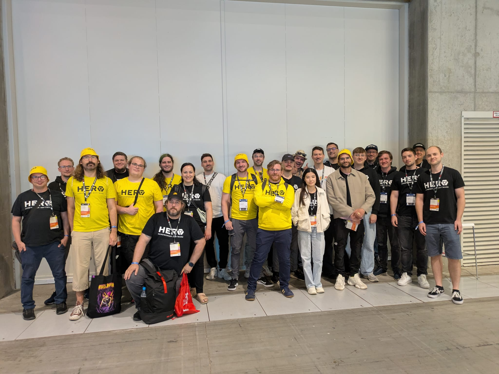
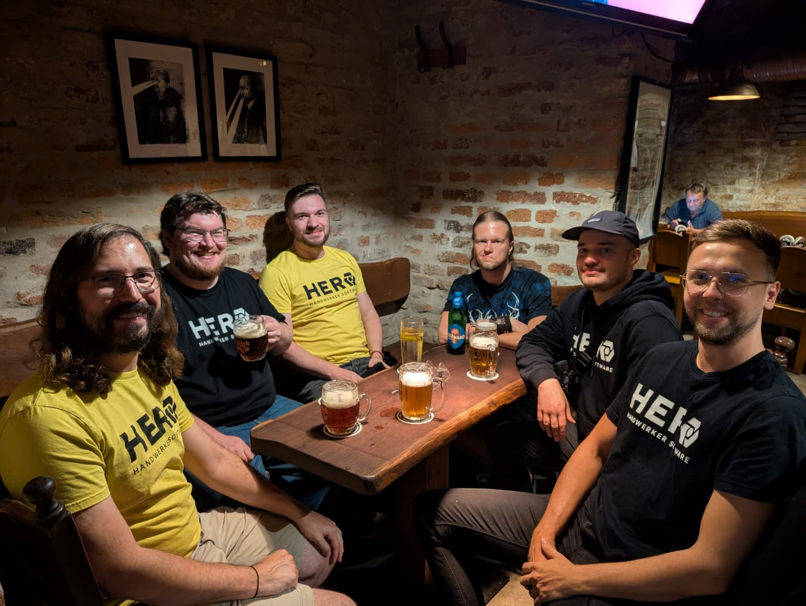

30 March marks two years at HERO for me, and coincidentally marks the beginning of my final month. I would therefore like to take a moment to reflect on what we shipped, what I learnt and what comes next.

Over the last two years, I have had the delight of interacting and working with teams from across the company. This post showcases the results of our collaboration, from design and engineering to product and operations.

This is not a farewell note or a list of individual successes, but rather a reflection on what we achieved together in such a short timeframe: the ideas that prevailed and those that did not, and the lessons learned from both.

---

## Design Vision

Arguably the initiative on which I have had the greatest impact, the Design Vision has had an equal impact on me ever since I started at HERO in April 2024. Initially, I joined the Interface Innovators initiative out of curiosity and a desire for a more forward-looking product.

What began as a collection of ideas gradually evolved into independent yet interconnected visions for the future of HERO across departments. I found myself sliding into a leadership role for the engineering initiative, albeit somewhat unwillingly.

During HERO's inaugural hackathon in 2024, we conceptualised and presented our vision for the HERO user interface and unexpectedly won the hackathon, capturing the attention of the product and leadership teams. This gave us the confirmation and encouragement we needed.

### Milestone 1.0

The first few months of 2025 were spent planning the incremental implementation steps for the proposals presented in previous months. The sidebar and top navigation were chosen as the first elements to be rolled out to customers under what would become known as _Design Vision 1.0_.

Together with [Dennis Eming](https://www.linkedin.com/in/denniseming/) and Sofien Scholze, we set out to provide a meaningful first glimpse of HERO's future appearance. In just a few weeks, we’ve not only conceptualised, but also shipped, the first iteration of the new navigation surfaces.

Thanks to an iterative approach to feedback and improvements, enabled by [Sarah Köksal](https://www.linkedin.com/in/dr-sarah-k%C3%B6ksal-4256a3103/)‘s research and feedback collection, we achieved a satisfactory result for customers shortly after the initial launch, maintaining a high degree of polish throughout the broader rollout.

<figure>
  
  
  <figcaption>Sidebar and top navigation introduced with milestone 1.0</figcaption>
</figure>

### Milestone 1.5

By this time, the Design Vision had evolved from a modest UI/UX initiative into a more comprehensive initiative that impacted both external and internal aspects of the product. I’d like to think of it as the catalyst for introducing the workspace with new apps and packages.

With this in mind, the focus of this milestone was to prepare resources for designers and developers to use. During this period, we researched and implemented a new design system, developed new application patterns for future use and introduced specialised packages.

Although the Design Vision 1.5 initiative was ultimately delayed due to ongoing resource constraints, the results achieved up to that point were reliable and useful enough to lay a solid foundation for HERO's technical future.

---

## Hackathons

During my time here, I had the honour of collaborating with amazing people on two hackathons. The concepts produced during these events have now been incorporated into the product. These wins were achieved by the 2024 and 2025 teams.

In 2024, I collaborated with Dennis Eming , Fynn Schlegel, and [Jaro Lenz](https://www.linkedin.com/in/jaro-lenz-304245250/) on redesigning the dashboard, sidebar, and top navigation. This ultimately won us first place and laid the conceptual groundwork for the first milestone of the Design Vision.

<figure>
  <video controls autoplay muted loop>
    <source src="/media/2024_hero_hackathon.mp4" type="video/mp4" />
  </video>
  <figcaption>2024 HERO hackathon demo of the modular dashboard</figcaption>
</figure>

In 2025, I collaborated with [Alexis-Rae Jager](https://www.linkedin.com/in/alexis-rae-jager-070bb125a/), Dennis Eming, Fynn Schlegel and Nico Brockel on redefining the theme customization of HERO. This project involved reworking the platform's outdated personalisation options, and it won us first place (again).

<figure>
  <video controls autoplay muted loop>
    <source src="/media/2025_hero_customisation.mp4" type="video/mp4" />
  </video>
  <figcaption>2025 HERO hackathon demo of the theme customisation</figcaption>
</figure>

---

## Trips

I accompanied my colleagues on many occasions, some of which were more turbulent than others. Nevertheless, I cherish every trip, near or far, that I had the pleasure of experiencing, with a special mention for Martin Matthaei, who managed to appear on all of them.

In 2024, I attended the WeAreDevelopers congress for the first time, followed shortly by a workation in Groningen in the Netherlands. While the former was blasted by a heatwave, the latter turned out to be a more tranquil experience.

<figure>
  
  
  <figcaption>Groningen Workation, 2024</figcaption>
</figure>

<figure>
  
  
  <figcaption>WeAreDevelopers Congress, 2024</figcaption>
</figure>

In 2025, I revisited the WeAreDevelopers Congress with an even larger group, making a notable, colourful appearance at the event. Just two months later, a local Prague citizen guided us to an (literal) underground metal bar, where we had the pleasure of sampling local beverages.

<figure>
  
  
  <figcaption>WeAreDevelopers Congress, 2025</figcaption>
</figure>

<figure>
  
  
  <figcaption>Prague Workation, 2025</figcaption>
</figure>

---

## What we shipped

Over the last two years, much of my work has been at the intersection of design, engineering and product delivery. Some of this work was immediately visible, such as the sidebar and top navigation, while much of it occurred deeper within the stack.

This included migrating build tooling, reshaping packages, refining application patterns, and preparing the new architecture for broader adoption. These changes were rarely glamorous, but they made HERO easier to evolve, faster to ship, and considerably more coherent.

At the same time, I had the opportunity to work on features that were delivered directly to customers. These ranged from stock management and dunning flows to improvements across Wallet and notifications. The goal was to remove friction without compromising maintainability.

Whether the task involved introducing a new workflow, fixing a long-standing inconsistency, or improving interface clarity, the work only felt worthwhile when it reduced complexity for users and the teams building for them.

A recurring theme throughout was that technical change only matters when it enables better product decisions. The shift towards shared packages, stronger conventions, personalisation and modern navigation was not just about neater code.

It was about providing teams with a more reliable foundation on which to build. The result was a product that felt more intentional, a platform that behaved more predictably, and a codebase that was better prepared for whatever came next.

### Quiet Work

The quieter work behind those milestones mattered just as much. I spent considerable time fixing edge cases, removing brittle patterns, standardising tooling, and untangling areas that had become hard to understand for developers and users alike.

Some of my most meaningful contributions were not new features, but repeated structural improvements. I clarified conventions, optimised build steps, and streamlined developer and user workflows, reducing friction and making collaboration smoother.

I came to view internal work as product work. Every bug that was prevented and every inconsistency that was removed gave future teams more momentum, proving that improving systems was just as important as achieving visible results.

---

## What I learnt

### Engineering

From a technical perspective, I have gained a clearer understanding of architecture and how it has evolved over time. I have also learned how to maintain it, when and where to modernise it, and when to stand my ground based on experience.

It has been fascinating to observe and influence the architecture and the increasing speed of its modernisation efforts, especially over the last year as it has been rolled out to more and more teams, producing tangible feedback requiring improvements.

I have also learned to assert myself on topics I am familiar with, as previous approaches were rather unsuccessful. I now feel more confident in articulating the risks and side effects of an approach and in knowing where to find a compromise.

### Product

In terms of products, I’ve learned that closing the loop with users quickly enables iteration through direct feedback. I’ve also learned that 'good enough' can be excellent enough when delivering an initial feature for validation.

It is important to identify and address core issues reported by users through actionable feedback rather than a theoretical approach. Combined with quantitative data from UX research, this approach has enabled me to make more informed and impactful decisions.

I’ve also come to terms with my perfectionist tendencies, which are near impossible to achieve in an ever-growing stack of software that is the product of many. I wrote about this personal development in my article: [The Sisyphean Struggle for Simplicity](https://jairusjoer.com/archive/aggregata/the-sisyphean-struggle-for-simplicity/).

### Team

From my experience of participating in various teams, I have learned that momentum and confidence are built through technically solid foundations shaped by small, high-quality iterations and reinforced transparent communication mechanisms.

The quality of the software code dictates the momentum and confidence a team has in shipping features. Therefore, it became imperative for me to identify not only friction within a team's work, but also across teams, in order to provide a single source of truth.

When it comes to communication, both positive and negative feedback must be shared and heard. This is not always easy, but it is especially important in frustrating moments to properly acknowledge your colleagues' concerns and issues instead of sidelining them.

---

## What comes next

30 April will be my last day at HERO. I have taken great care to ensure that the initiatives most important to me are transferred to trusted teams, and I am confident that they are in good hands for the future of the company and its products.

For me, this last month will be about making one final impact. I will address long-neglected topics and tie up loose ends wherever possible, so that future designers and engineers may appreciate and build upon my work as much as I did.

From May onwards, I will be working on a new project related to Germany’s digitalisation efforts at BWI. As far as I can tell, my role will involve supporting the development of open-source software for various connected codebases, which I am very excited about.

---

**Until next time** 
_Yours truly, Jairus Joer_
