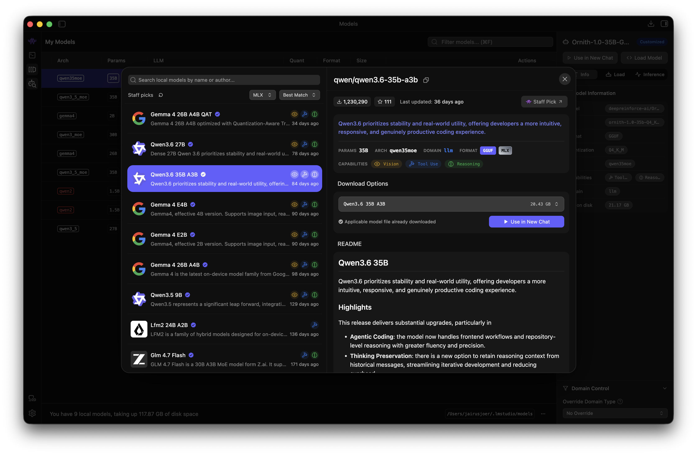

Since May, I had the delight of exploring and working with AI models through local providers, as well as different coding agents; not without thanks to the 36 GB of unified RAM on the MacBook I am working on.

I’d like to share the progress I’ve made since then on my local setup, which partially motivated me also to share my [_Thoughts on Resilience, Sustainability and Sovereignty_](/writing/thoughts-on-resilience-sustainability-and-sovereignty) in a previous blog post.

Bear in mind that the progress I am sharing here is that of an amateur in the field of _artificial intelligence_, particularly in this particular context. With that in mind, let's delve into my progress.

## Provider

I opted for [LM Studio](https://lmstudio.ai/) because I enjoy the ease of use of the graphical user interface. The installation and onboarding processes were straightforward, and the hardware support was automatically configured and ready for use.

I experimented with [Ollama](https://ollama.com/) in a previous attempt, and while I had no issues in terms of user experience or performance, I found the built-in model discovery and configuration features of LM Studio more appealing.

From the onboarding process to running my first model locally, I only needed to click through the model discovery. At the time, I had no knowledge of different quantisation approaches, such as MLX and GGUF.

## Models

After installing and trying out some models via the built-in chat interface with varying success, I sat down and started exploring model sizes, quantisation and hardware support in order to make more informed decisions.

As my endeavour coincided with Google’s release of its newest models, particularly [`google/gemma-4-26b-a4b-qat`](https://lmstudio.ai/models/google/gemma-4-26b-a4b-qat), I was intrigued to try them out, having previously had positive experiences with their Gemini models.

On the other hand, is a model completely unfamiliar to me. Enter Alibaba’s [`qwen/qwen3.6-35b-a3b`](https://lmstudio.ai/models/qwen/qwen3.6-35b-a3b). Similar to Google’s model, it is a [Mixture of Experts](https://www.ibm.com/think/topics/mixture-of-experts) model, but, contrary to that, it did not undergo [quantisation-aware training](https://www.ibm.com/think/topics/quantization-aware-training).

### Qwen 3.6 35B A3B

`qwen/qwen3.6-35b-a3b` has been my primary choice of model since this exploration began in May. It's running on MLX with 4bit quantisation and averages above 80 tok/sec ouput, hitting high 90s on a good day.

I’ve mostly been using it for agentic engineering tasks, including writing and fixing tests, maintaining documentation and performing governance tasks, as well as simple to medium-complex code-related grunt work.

### Gemma 4 26B A4B QAT

#### Other

- `ornith-1.0-35b`
- `ornith-1.0-35b-mtplx`
- `google/gemma-4-e2b`
- `qwen/qwen3-coder-30b`
- `qwen2.5-coder-1.5b-instruct-mlx`
- `qwen/qwen3.6-27b`

## Harnesses

- OpenCode
- GitHub Copilot
