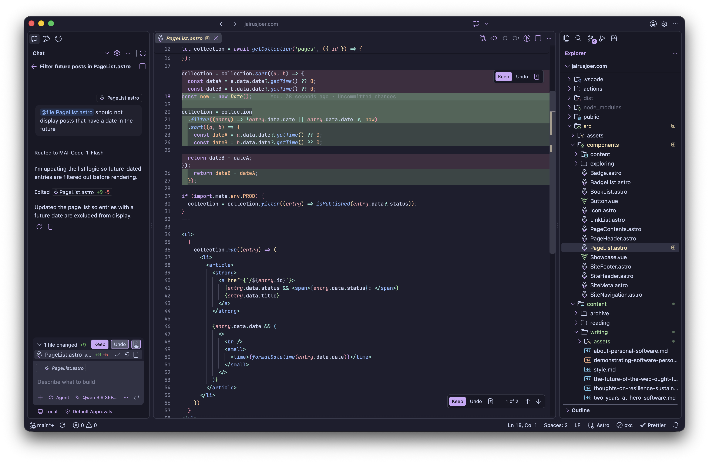
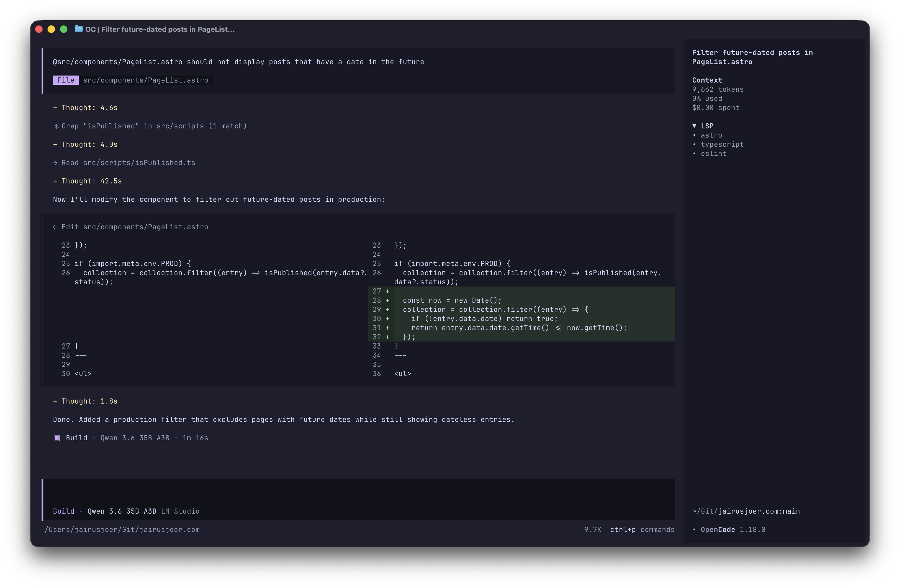

Since May, I've had the delight of experimenting and working with AI models through local providers, as well as different coding agents; not without thanks to the 36 GB of unified RAM on the MacBook I am working on.

I’d like to share the progress I’ve made since then on my local setup, which partially motivated me also to share my [_Thoughts on Resilience, Sustainability and Sovereignty_](/writing/thoughts-on-resilience-sustainability-and-sovereignty) in a previous post.

Bear in mind that the progress I am sharing here is that of an enthusiast in the field of _agentic engineering_, particularly in this particular context. With that in mind, let's delve into my progress.

---

## Provider

I opted for [LM Studio](https://lmstudio.ai/) because I enjoy the ease of use of the graphical user interface. The installation and onboarding processes were straightforward, and the hardware support was automatically configured and ready for use.

I experimented with [Ollama](https://ollama.com/) in a previous attempt, and while I had no issues in terms of user experience or performance, I found the built-in model discovery and configuration features of LM Studio more appealing.

From the onboarding process to running my first model locally, I only needed to click through the model discovery. At the time, I had no knowledge of different quantisation approaches, such as MLX and GGUF.


---

## Models

After installing and trying out some models via the built-in chat interface with varying success, I sat down and started experimenting with model sizes, quantisation and hardware support in order to make more informed decisions.

As my endeavour coincided with Google’s release of its newest models, particularly [`google/gemma-4-26b-a4b-qat`](https://lmstudio.ai/models/google/gemma-4-26b-a4b-qat), I was intrigued to try them out, having previously had positive experiences with their Gemini models.

Then there's a model completely unfamiliar to me. Enter Alibaba’s [`qwen/qwen3.6-35b-a3b`](https://lmstudio.ai/models/qwen/qwen3.6-35b-a3b). Similar to Google’s model, it is a [Mixture of Experts](https://www.ibm.com/think/topics/mixture-of-experts) model, but, contrary to that, it did not undergo [quantisation-aware training](https://www.ibm.com/think/topics/quantization-aware-training).

### Qwen 3.6 35B A3B

`qwen/qwen3.6-35b-a3b` has been my primary choice of model since this experiment began in May. It's running on **MLX** with **4bit** quantisation and averages above **85+ tok/sec** output, hitting high 90s on a good day.

I’ve mostly been using it for agentic engineering tasks, such as writing and debugging tests, maintaining and carrying out governance tasks, as well as simple to medium-complex, code-related menial work.

I’ve also used this model to adjust load parameters, deciding on a context length of **98,304** and a repeat penalty of **1.1** to solve repetition issues. In addition, I opted for **'thinking'** and **'preserved thinking'**.

### Gemma 4 26B A4B QAT

`google/gemma-4-26b-a4b-qat` is my second choice of model. Using the same quantisation and load parameters, its token output performance matches that of `qwen/qwen3.6-35b-a3b`.

I’ve been using it for work similar to that mentioned above, but primarily for research- and documentation-focused tasks. While this is purely subjective, I _felt_ that Gemma responded better to this type of work.

It has also proven useful for projects and workloads that require more RAM, as it is approximately 5 GB smaller than the Qwen model, providing some additional capacity before memory begins to overflow.

---

## Harnesses

To interact with my chosen models in an agentic manner, I use GitHub Copilot in Visual Studio Code and OpenCode via the terminal to provide me with capable Plan and Build agents to work with.

Both harnesses have proven their worth in ongoing use cases against competitors such as Continue, Claude Code and [Pi](https://pi.dev/). While the others didn’t prevail, I have decided to give Pi another try.

I won’t discuss Pi in detail in this post, as I haven’t yet reached a conclusive stage in my experiments with it. Instead, I’ll focus on GitHub Copilot and OpenCode. Perhaps I will cover Pi in a future post.

### GitHub Copilot

Even before I switched to local models, GitHub Copilot was my primary agentic driver, thanks to its extensive and reliable integration capabilities and its ability to interact with extensions.

The only issue I’ve had with GitHub Copilot so far is that it won't suggest code completions based on local models. I tried using the Continue extension to resolve this, but there were ongoing problems with consistency.

GitHub Copilot requires a [custom endpoint](https://code.visualstudio.com/docs/agent-customization/language-models#_add-a-custom-endpoint-model) to connect to LM Studio, with manual entries for each model. Language model extensions are also available for popular providers and handle local model discovery automatically.



```json
[
  {
    "name": "LM Studio",
    "vendor": "customendpoint",
    "models": [
      {
        "id": "qwen/qwen3.6-35b-a3b",
        "name": "Qwen 3.6 35B A3B",
        "url": "http://localhost:1234/v1/chat/completions",
        "toolCalling": true,
        "vision": true,
        "maxInputTokens": 65536,
        "maxOutputTokens": 65536
      },
      {
        "id": "google/gemma-4-26b-a4b-qat",
        "name": "Gemma 4 26B A4B QAT",
        "url": "http://localhost:1234/v1/chat/completions",
        "toolCalling": true,
        "vision": true,
        "maxInputTokens": 65536,
        "maxOutputTokens": 65536
      }
    ]
  }
]
```

### OpenCode

OpenCode has established itself as my primary harness of choice and delivers a satisfactory agentic coding experience for my needs. Both the out-of-the-box experience and the interface are incredibly intuitive.

I haven’t encountered any ongoing issues with OpenCode that haven't resolved themselves. I did encounter some minor issues with subagents and tool calls during the initial sessions, but it has been consistently reliable since then.

Configuration for OpenCode is placed in `~/.config/opencode/opencode.jsonc`. For convenience when working with strongly typed and styled code, I’ve opted for **LSP** and **Formatting**, as well as my shell of choice, [fish](https://fishshell.com/).



```json
{
  "$schema": "https://opencode.ai/config.json",
  "plugin": [],
  "lsp": true,
  "formatter": true,
  "shell": "fish",
  "provider": {
    "lmstudio": {
      "npm": "@ai-sdk/openai-compatible",
      "name": "LM Studio",
      "options": {
        "baseURL": "http://localhost:1234/v1"
      },
      "models": {
        "qwen/qwen3.6-35b-a3b": {
          "name": "Qwen 3.6 35B A3B"
        },
        "google/gemma-4-26b-a4b-qat": {
          "name": "Gemma 4 26B A4B QAT"
        }
      }
    }
  }
}
```

---

While writing this post, I have continued to experiment with new models such as `prism-ml/Bonsai-27B-AWQ-4bit` and Pi as a harness, as well as extensions for my existing harnesses and parameter fine-tuning.

Should this ongoing experimentation yield reportable results, I will be delighted to provide a follow-up post on this particular matter. In the meantime, the current setup should suffice for most people to get started.

I am excited about the future capabilities of local AI models, both in terms of self-hosting and agentic engineering and in terms of how on-device or system models will integrate with future software.

---

**Until next time**<br/>
_Yours truly, Jairus Joer_
